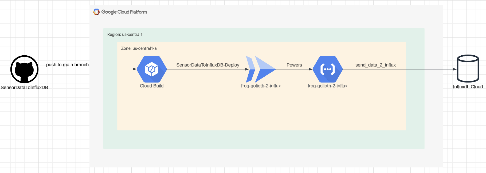

# SensorDataToInfluxDB
A Google Cloud Function designed to receive sensor data via HTTP requests and store it in an InfluxDB instance. The function performs data validation, parsing, and writes time-series data for IoT devices.

